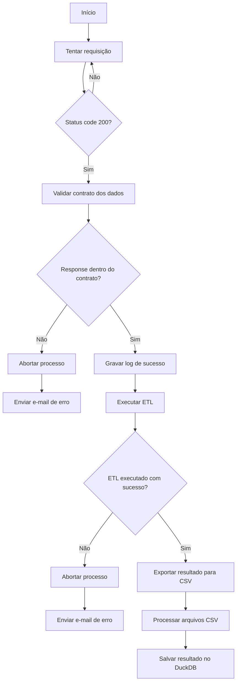

# Documentação Pipeline Cyber Picpay

## Fluxo do processo

```mermaid
graph TD;
    A[Início] --> B[Tentar requisição];
    B --> C{Status code 200?};
    C -- Não --> B;
    C -- Sim --> D[Validar contrato dos dados];
    D --> E{Response dentro do contrato?};
    E -- Não --> F[Abortar processo];
    F --> F1[Enviar e-mail de erro];
    E -- Sim --> G[Gravar log de sucesso];
    G --> H[Executar ETL];
    H --> I{ETL executado com sucesso?};
    I -- Não --> J[Abortar processo];
    J --> J1[Enviar e-mail de erro];
    I -- Sim --> K[Exportar resultado para CSV];
    K --> L[Processar arquivos CSV];
    L --> M[Salvar resultado no DuckDB];

```

## End points

